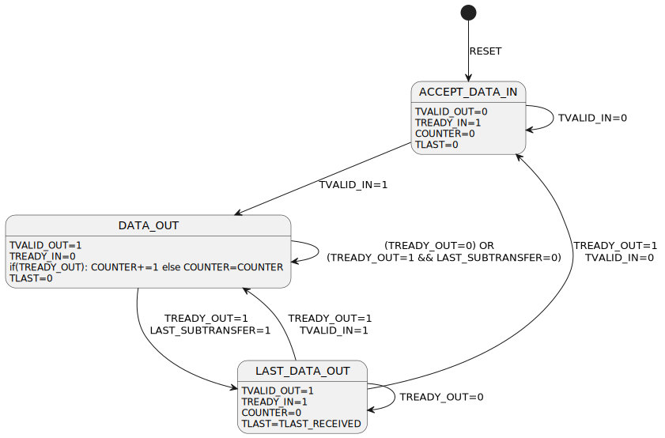

# AXI Stream DataWidth Downsizer
This module can downsize an arbitrarily big AXI-Stream to a smaller AXI-Stream. The data width of the bigger stream must be an integer multiple of the data width of the smaller stream. Also, the data width of the input stream must be strictly greater than that of the output stream. Data accepted at the input port will be one clock cycle later at the output port (no pass through).

## Signal Transmission Characteristic
- TVALID -> See state diagram
- TREADY -> See state diagram
- TSRB -> preserved per byte
- TKEEP -> preserved per byte (! Attention: transfers with TKEEP deasserted are not removed from the data stream)
- TLAST -> shows up on the last sub-transfer as per the specification
- TID -> is transmitted fully on every sub-transfer
- TDEST -> is transmitted fully on every sub-transfer
- TUSER -> is transmitted fully on every sub-transfer

## State Diagram

