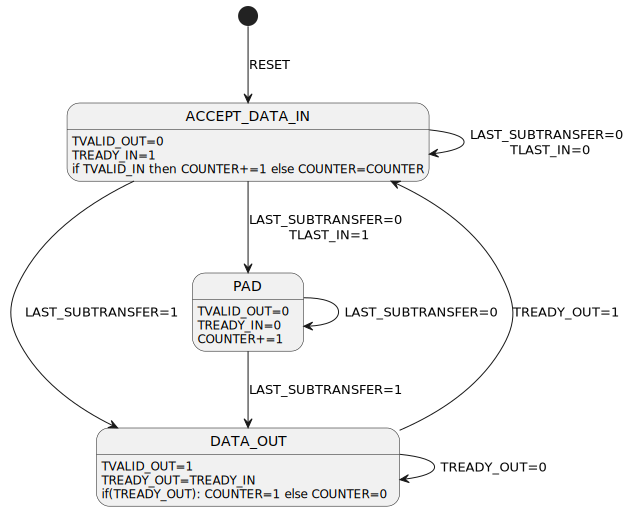

# AXI Stream DataWidth Upsizer
This module can upsize a smaller AXI-Stream to an arbitrarily big AXI-Stream. The data width of the bigger stream must be an integer multiple of the data width of the smaller stream. Also, the data width of the output stream must be strictly greater than that of the input stream. Data will be one clock cycle delayed at the ouput in addition to the expected data width in-to-out delay (no pass through).

## Signal Transmission Characteristic
- TVALID -> See state diagram
- TREADY -> See state diagram
- TSRB -> preserved per byte
- TKEEP -> preserved per byte (! Attention: transfers with TKEEP deasserted are not removed from the data stream)
- TLAST -> shows up on the last transfer as per the specification
- TID -> only the data of the last sub-transfer in a output transfer is transmitted
- TDEST -> only the data of the last sub-transfer in a output transfer is transmitted
- TUSER -> only the data of the last sub-transfer in a output transfer is transmitted

## State Diagram

